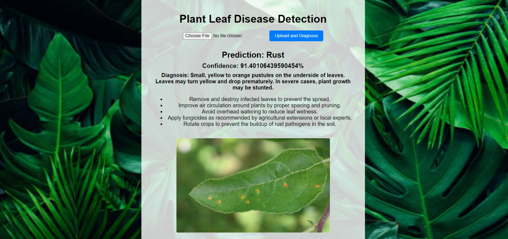

# Plant Leaf Disease Detection

This is a web-based application for detecting plant leaf diseases using deep learning. Users can upload leaf images, and the application will provide a prediction on the leaf's health condition, along with confidence levels, a detailed diagnosis, and recommended actions.

## Features

- **Upload an Image**: Upload a plant leaf image for analysis.
- **Disease Prediction**: The model predicts the health status of the plant (Healthy, Rust, or Powdery Mildew).
- **Confidence Score**: A percentage confidence score accompanies the prediction.
- **Diagnostic Information**: Details about the predicted disease with suggestions for treatment and preventive actions.

## Dataset

The model is trained on a **Plant Disease Recognition Dataset** from Kaggle. This dataset contains 1530 images, categorized into three labels:
- **Healthy**
- **Powdery Mildew**
- **Rust**

The dataset is divided into training, testing, and validation sets. You can explore the dataset [here](https://www.kaggle.com/datasets/rashikrahmanpritom/plant-disease-recognition-dataset).

## Accuracy

- **Test Accuracy**: 97.33%
- **Validation Accuracy**: 94.55%

## Required libraries:

- Flask
- TensorFlow
- NumPy

## Project Structure
- app.py: The Flask backend, handling image uploads, model predictions, and serving the results.
- index.html: The frontend interface where users upload images and view predictions.
- styles.css: Styling for the web page.
- model/best_model.keras: The saved model for disease prediction.
- uploads/: Directory to store user-uploaded leaf images.


## How to Run

Run the Flask server:

```bash
python app.py
```

Open your browser and navigate to:

http://127.0.0.1:5000/

Upload a leaf image, and the app will return a prediction and confidence level, along with diagnostic suggestions.




## Model and Training Details
The model used for prediction is based on MobileNetV2, a lightweight convolutional neural network. It has been trained on the aforementioned dataset using the following three classes:

- Healthy: No signs of disease.
- Powdery Mildew: A fungal disease showing white powdery spots on leaves.
- Rust: A disease with orange-yellow pustules on leaves.
Training Process
Data was augmented with techniques like horizontal flipping, zooming, and rotation to improve model generalization.
The model was trained using categorical cross-entropy loss and Adam optimizer, with early stopping and learning rate reduction callbacks.
